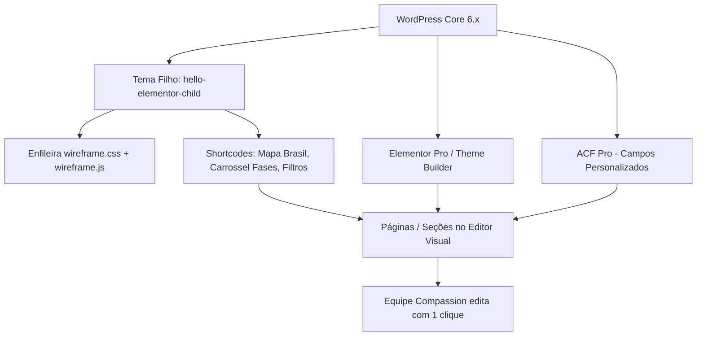

# Guia Completo de Migração e Integração: Compassion Brasil no WordPress com Elementor

Este documento descreve detalhadamente o processo de implantação do site institucional da **Compassion Brasil** no ecossistema **WordPress**, conectando sua estrutura visual, CSS moderno e scripts interativos ao construtor visual **Elementor** e campos personalizados (**ACF - Advanced Custom Fields**).

O objetivo é manter 100% da fidelidade estética e interatividade (como o mapa interativo do Brasil e os carrosséis) ao mesmo tempo em que a equipe técnica e de comunicação da Compassion ganha autonomia absoluta para editar textos, trocar fotos, links de apadrinhamento e métricas de impacto através de uma interface intuitiva.

---

## Sumário
1. [Visão Geral da Arquitetura](#1-visão-geral-da-arquitetura)
2. [Estratégia Recomendada: Arquitetura Híbrida (Tema Base + Elementor + ACF)](#2-estratégia-recomendada-arquitetura-híbrida)
3. [Preparação do Ambiente WordPress & Plugins Necessários](#3-preparação-do-ambiente-wordpress--plugins-necessários)
4. [Passo a Passo de Instalação e Subida do Tema](#4-passo-a-passo-de-instalação-e-subida-do-tema)
5. [Enfileiramento dos Assets (`wireframe.css`, `wireframe.js` e Imagens)](#5-enfileiramento-dos-assets)
6. [Mapeamento Seção por Seção: Conexão com o Elementor](#6-mapeamento-seção-por-seção-conexão-com-o-elementor)
   - 6.1. Header & Menu de Navegação
   - 6.2. Hero com Vídeo em Background
   - 6.3. Seção Estatísticas / Impacto
   - 6.4. Seção "Como Trabalhamos" (As 4 Fases de Atuação)
   - 6.5. Seção "Nossos Programas" (Grid Filtrável com Pictogramas)
   - 6.6. Seção "Onde Atuamos" (Mapa Interativo do Brasil SVG)
   - 6.7. Seção Histórias / Depoimentos
   - 6.8. Seção Cursos em Destaque
   - 6.9. Seção Dúvidas Frequentes (FAQ / Accordion)
   - 6.10. Footer Institucional
7. [Alternativa com Widgets Customizados do Elementor (Addon Próprio)](#7-alternativa-com-widgets-customizados-do-elementor)
8. [Governança, Permissões e Guia Operacional para a Equipe](#8-governança-permissões-e-guia-operacional)
9. [Checklist Final de Publicação (Go-Live)](#9-checklist-final-de-publicação-go-live)

---

## 1. Visão Geral da Arquitetura

O site atual é composto por:
- **`index.html`**: Estrutura semântica com recursos complexos (mapa vetorial SVG inline de 1MB+, filtros por abas, carrosséis e modais).
- **`wireframe.css`**: Design system completo (tokens de cores Compassion, tipografia, micropolimentos, tooltips customizados e responsividade).
- **`wireframe.js`**: Lógica de scroll, barra de progresso, contador de estatísticas, alternador de filtros, interatividade do mapa do Brasil e carrossel de fases.
- **`assets/`**: Pictogramas SVG oficiais, logotipos e fotos em alta definição da Compassion.

### Desafio
Se colarmos todo o código bruto em um único bloco HTML dentro do Elementor, a equipe não conseguirá editar textos visualmente de forma limpa. Por outro lado, tentar recriar o mapa vetorial e os carrosséis diretamente pelos widgets básicos do Elementor causará perda de performance e quebra de fidelidade visual.

### Solução Ideal
Adotar a **Arquitetura Híbrida**:
- **Elementos Estruturais & Design System:** Enfileirados via tema filho (*Hello Elementor Child*).
- **Conteúdos Editáveis do Dia a Dia (textos, botões, títulos, cards comuns):** Editados visualmente via Elementor ou painel ACF amigável.
- **Módulos Críticos (Mapa SVG interativo e Carrossel das 4 Fases):** Encapsulados em **Shortcodes** ou **Widgets Customizados do Elementor**, alimentados por dados do WordPress.

---

## 2. Estratégia Recomendada: Arquitetura Híbrida



Essa abordagem garante:
1. **Velocidade e SEO:** Sem excesso de divs desnecessárias do Elementor nos módulos pesados.
2. **Segurança Técnica:** A equipe nunca corre o risco de deletar acidentalmente uma tag do mapa SVG ou desconfigurar os atributos de região.
3. **Facilidade Operacional:** Alterar o texto de uma fase ou a foto de um card é tão simples quanto preencher um formulário com botão de upload.

---

## 3. Preparação do Ambiente WordPress & Plugins Necessários

### Plugins Essenciais
Instale e ative no WordPress:
1. **Elementor** (Versão gratuita já atende boa parte; **Elementor Pro** é ideal para Theme Builder de Header/Footer e CSS customizado).
2. **Advanced Custom Fields (ACF)** ou **ACF Pro**: Para criação de campos de texto, imagens e repetidores (Repeaters) vinculados à página.
3. **SVG Support** ou **Safe SVG**: Permite o upload de pictogramas e ícones SVG com sanitização contra scripts maliciosos.
4. **WPCode (Insert Headers and Footers)** ou criação direta no `functions.php`: Para injetar scripts e tokens globais com facilidade.
5. **Smush** ou **Converter for Media (WebP)**: O diretório de fotos possui arquivos em alta resolução (algumas acima de 15MB). É **obrigatório** gerar versões WebP otimizadas para carregamento rápido.

---

## 4. Passo a Passo de Instalação e Subida do Tema

### 4.1. Criar o Tema Filho do Hello Elementor
No diretório `wp-content/themes/`, crie a pasta:
`wp-content/themes/compassion-brasil-child/`

Crie o arquivo `style.css`:
```css
/*
Theme Name: Compassion Brasil Child
Theme URI: https://compassion.com.br
Description: Tema institucional customizado para a Compassion Brasil integrado ao Elementor.
Author: Compassion Brasil
Template: hello-elementor
Version: 1.0.0
*/
```

Crie o arquivo `functions.php` para carregar as dependências e registrar os recursos.

---

## 5. Enfileiramento dos Assets (`wireframe.css`, `wireframe.js` e Imagens)

No arquivo `functions.php` do tema filho:

```php
<?php
// Carrega estilos e scripts do projeto Compassion
function compassion_enqueue_assets() {
    $theme_dir = get_stylesheet_directory_uri();
    $theme_path = get_stylesheet_directory();

    // 1. Google Fonts oficiais do projeto
    wp_enqueue_style(
        'compassion-google-fonts',
        'https://fonts.googleapis.com/css2?family=Montserrat:ital,wght@0,300..900;1,300..900&family=Playfair+Display:ital,wght@0,400..900;1,400..900&display=swap',
        array(),
        null
    );

    // 2. CSS Principal (wireframe.css)
    wp_enqueue_style(
        'compassion-wireframe-css',
        $theme_dir . '/assets/css/wireframe.css',
        array('hello-elementor'),
        filemtime($theme_path . '/assets/css/wireframe.css')
    );

    // 3. JS Principal (wireframe.js)
    wp_enqueue_script(
        'compassion-wireframe-js',
        $theme_dir . '/assets/js/wireframe.js',
        array('jquery'),
        filemtime($theme_path . '/assets/js/wireframe.js'),
        true // Carregar no footer
    );
}
add_action('wp_enqueue_scripts', 'compassion_enqueue_assets');
```

### Estrutura de pastas recomendada dentro do tema filho:
```
wp-content/themes/compassion-brasil-child/
├── style.css
├── functions.php
├── assets/
│   ├── css/
│   │   └── wireframe.css
│   ├── js/
│   │   └── wireframe.js
│   ├── images/       (Upload das fotos do projeto)
│   ├── Pictograms/   (SVGs dos pictogramas)
│   └── svg/
└── template-parts/
    ├── section-fases.php
    ├── section-mapa.php
    └── section-programas.php
```

---

## 6. Mapeamento Seção por Seção: Conexão com o Elementor

Abaixo está o guia exato de como cada seção do `index.html` deve ser transferida para o WordPress e como a equipe editará cada elemento.

---

### 6.1. Header & Menu de Navegação

* **Como implementar:**
  - Criar um **Header Template** no **Elementor Theme Builder** (ou usar o menu padrão do WordPress em `Aparência > Menus`).
  - Container Flexbox horizontal com fundo transparente/vidro (`backdrop-filter: blur(12px)` conforme `wireframe.css`).
* **Itens do Menu:**
  - Início (`#hero`)
  - Como Trabalhamos (`#como-trabalhamos`)
  - Programas (`#programas`)
  - Onde Atuamos (`#impacto`)
  - Cursos (`cursos.html`)
  - Botão CTA: "Apadrinhe Agora" (link de direcionamento externo para a plataforma de apadrinhamento).
* **Como a equipe edita:**
  - Adicionar, renomear ou trocar links em **Aparência > Menus** sem precisar abrir o Elementor.

---

### 6.2. Hero com Vídeo em Background

* **Estrutura no Elementor:**
  - Seção Container Full Width com altura mínima de `100vh`.
  - Elemento de Vídeo com o ID do YouTube em background ou iframe silencioso com loop (`hero-video-bg`).
  - Div overlay `.hero-video-overlay` para bloqueio de controles e contraste escuro.
  - Título H1: *"Pobreza não é o fim da história. É onde a transformação começa."*
  - Subtítulo e botões de chamada com as classes `btn-primary` e `btn-secondary`.
* **Como a equipe edita no Elementor:**
  - Clicando diretamente sobre o texto para alterar o título e subtítulo.
  - No painel lateral do botão, alterando o link de destino.

---

### 6.3. Seção Estatísticas / Impacto (Contador Numérico)

* **Estrutura:**
  - Grid de 4 colunas com classes `.stat-card` e atributos `data-target="2200000"` para contagem animada.
* **Como implementar:**
  - Usar o widget nativo de **Contador (Counter)** do Elementor ou um bloco HTML com os atributos atuais para aproveitar o efeito JavaScript do `wireframe.js`:
    ```html
    <div class="stat-number" data-target="2300000">0</div>
    <div class="stat-label">Crianças Atendidas</div>
    ```
* **Como a equipe edita:**
  - Alterando diretamente o número no painel lateral do Elementor sempre que os relatórios anuais da Compassion forem atualizados.

---

### 6.4. Seção "Como Trabalhamos" (As 4 Fases de Atuação)

Esta seção possui o carrossel de 4 cards com linha colorida, textos longos descritivos e fotos representativas.

* **Fotos Oficiais Configuradas:**
  1. **Sobrevivência:** `assets/images/PG23 PROGRAMA SOBREVIVENCIA  OP1.jpg` (Linha amarela)
  2. **Primeira Infância:** `assets/images/CC_BR0524_TheySurvived_13_2307.jpg` (Linha azul)
  3. **Infância:** `assets/images/CC_BR_MyHappyPlace_05_2312.jpg` (Linha verde)
  4. **Juventude:** `assets/images/CC-BR040700645-MyNewSong-13-2211.jpg` (Linha laranja)

* **Melhor Forma de Integração (Shortcode com ACF Repeater):**
  1. No ACF, crie um Grupo de Campos **"Fases de Atuação"** com um Repetidor (`fases_repetidor`):
     - `fase_titulo` (Texto)
     - `fase_cor` (Cor / Seletor: Amarelo, Azul, Verde, Laranja)
     - `fase_descricao` (Área de texto)
     - `fase_imagem` (Upload de Imagem)
  2. No `functions.php`:
     ```php
     function render_fases_carousel_shortcode() {
         ob_start();
         include get_stylesheet_directory() . '/template-parts/section-fases.php';
         return ob_get_clean();
     }
     add_shortcode('compassion_fases', 'render_fases_carousel_shortcode');
     ```
  3. No Elementor, basta arrastar o widget **Shortcode** e inserir `[compassion_fases]`.
* **Como a equipe edita:**
  - No painel da página no WordPress, aparece uma caixa amigável:
    - Card 1: Título, Descrição, botão para escolher nova foto na biblioteca.
    - Card 2: Título, Descrição, nova foto.
  - A equipe troca qualquer foto ou texto em segundos, e o layout, carrossel e classes CSS continuam intactos.

---

### 6.5. Seção "Nossos Programas" (Grid Filtrável com Pictogramas)

* **Estrutura:**
  - Tabs de filtro: *Todos*, *Proteção*, *Sobrevivência*, *Infância*, *Juventude*, *Intervenções (CIV)*.
  - Cards com pictograma SVG no topo, tag de categoria colorida e botão de ação (ex: Apadrinhar ou Saiba Mais).
* **Como implementar no WordPress:**
  - Pode ser construído via **Custom Post Type (CPT)** chamado `Programas` ou via campos ACF na página.
  - Cada programa possui:
    - Título
    - Categoria (Taxonomia para o filtro funcionar: `protecao`, `sobrevivencia`, etc.)
    - Pictograma (Ícone SVG)
    - Descrição
    - Link do botão
* **Como a equipe edita:**
  - Adicionando um novo programa ou editando o texto existente em **Programas > Editar**.

---

### 6.6. Seção "Onde Atuamos" (Mapa Interativo do Brasil SVG)

Esta é a seção mais técnica do site, contendo o SVG interativo com 27 estados, regiões coloridas, modal lateral e o **tooltip flutuante**.

* **Por que NÃO desenhar isso no Elementor:**
  - O Elementor não possui nós vetoriais `<path>` nativos com `data-state`, `data-region` e cálculos de coordenadas para mousehover.
* **Como integrar com segurança máxima:**
  1. Crie o arquivo `template-parts/section-mapa.php` com o SVG e a estrutura HTML da seção.
  2. Registre o shortcode `[compassion_mapa_brasil]` no `functions.php`:
     ```php
     function render_mapa_brasil_shortcode() {
         ob_start();
         get_template_part('template-parts/section-mapa');
         return ob_get_clean();
     }
     add_shortcode('compassion_mapa_brasil', 'render_mapa_brasil_shortcode');
     ```
  3. No Elementor, basta inserir um container e o widget **Shortcode**: `[compassion_mapa_brasil]`.
* **Conexão dos Dados dos Estados:**
  - Os dados de crianças atendidas e igrejas parceiras por estado podem ser mantidos no script ou conectados a um painel de opções ACF (`Options Page`), onde a equipe digita o número atual de cada estado (ex: "Ceará: 32.500 crianças").

---

### 6.7. Seção Histórias / Depoimentos (Carrossel de Testemunhos)

* **Estrutura:**
  - Cards com foto da criança/família, citação inspiradora, nome, idade e comunidade/estado.
* **Como implementar:**
  - Pode-se utilizar o widget nativo de **Testimonial Carousel (Carrossel de Depoimentos)** do Elementor Pro aplicando a classe CSS `.stories-card`, OU
  - Criar um CPT `Histórias de Impacto` e listar com loop dinâmico.
* **Como a equipe edita:**
  - Inserindo o depoimento, autor e foto diretamente no painel do Elementor ou no CPT.

---

### 6.8. Seção Cursos em Destaque

* **Estrutura:**
  - Cards dos cursos de capacitação comunitária e salvaguarda com link para `cursos.html`.
* **Como implementar:**
  - Widgets de **Card** ou **Loop Grid** do Elementor apontando para as páginas filhas de cursos criadas no WordPress.

---

### 6.9. Seção Dúvidas Frequentes (FAQ / Accordion)

* **Estrutura:**
  - Accordion com perguntas e respostas sobre doações, apadrinhamento e atuação da igreja local.
* **Como implementar:**
  - Utilizar o widget nativo **Accordion** do Elementor.
  - Aplicar nas propriedades avançadas do widget a classe CSS `.faq-accordion` para herdar instantaneamente o estilo moderno e limpo sem sombras definido no `wireframe.css`.
* **Como a equipe edita:**
  - Clicando no item e editando pergunta e resposta visualmente.

---

### 6.10. Footer Institucional & Selo Mandalla

* **Estrutura (5 Colunas):**
  1. **Marca Compassion:** Logo em SVG branco + resumo da missão institucional.
  2. **Programas:** Links rápidos para as trilhas de desenvolvimento.
  3. **Cursos:** Catálogo, inscrições e certificados.
  4. **Contato:** E-mail institucional, parceria, imprensa e privacidade.
  5. **Siga-nos & Selo Mandalla:** Ícones circulares de redes sociais oficiais (Instagram e YouTube) e o selo `#feito com carinho` (`assets/FeitoComCarinho.svg`) com a assinatura *"Por Mandalla Comunicação & Design"* na fonte padrão Neighbour Sans.
  - Linha inferior (`footer-bottom`): Direitos autorais e CNPJ.
* **Como implementar no WordPress / Elementor:**
  - Criar o template no **Elementor Theme Builder > Footer** e definir a condição para exibir em todo o site (*Entire Site*).
  - A coluna **Siga-nos** deve conter o widget de Ícones Sociais (com estilo circular estilizado) e um bloco de imagem/HTML com o selo da Mandalla apontando para `https://mandalladesign.com.br`.

---

## 7. Alternativa com Widgets Customizados do Elementor

Se a equipe da Compassion preferir uma experiência 100% nativa de arrastar e soltar (drag and drop) na barra lateral do Elementor, você pode criar um mini-plugin complementar:

`wp-content/plugins/compassion-elementor-addon/compassion-elementor-addon.php`

### Exemplo de Registro de Widget do Elementor:
```php
<?php
/**
 * Plugin Name: Compassion Elementor Addons
 * Description: Widgets customizados para a Compassion Brasil.
 * Version: 1.0.0
 */

if ( ! defined( 'ABSPATH' ) ) exit;

function register_compassion_widgets( $widgets_manager ) {
    require_once( __DIR__ . '/widgets/widget-fases-atuacao.php' );
    require_once( __DIR__ . '/widgets/widget-mapa-brasil.php' );

    $widgets_manager->register( new \Compassion_Widget_Fases() );
    $widgets_manager->register( new \Compassion_Widget_Mapa() );
}
add_action( 'elementor/widgets/register', 'register_compassion_widgets' );
```

Dentro de `widget-fases-atuacao.php`, os controles do Elementor permitem criar listas repetíveis (Repeater Control) com campos de texto, cor e upload de imagem diretamente na barra lateral esquerda do Elementor.

---

## 8. Governança, Permissões e Guia Operacional para a Equipe

Para evitar alterações indevidas no código por usuários leigos, configure as funções de usuário do WordPress da seguinte forma:

| Perfil | Acesso Permitido | O que pode fazer |
|---|---|---|
| **Administrador** (TI / Devs) | Total | Instalar plugins, alterar código do tema, editar CSS global. |
| **Editor** (Comunicação / Marketing) | Elementor & Páginas | Trocar textos, atualizar fotos de campanhas, adicionar novas histórias e FAQs. Bloqueado para edição de código PHP/CSS. |
| **Autor / Colaborador** | Blog / Notícias | Criar artigos e notícias sobre projetos no campo. |

### Regra de Ouro para a Equipe Técnica da Compassion:
> **"Nunca altere as classes CSS `.phase-card-left`, `.phase-card-right`, `.state-path` ou `#mapTooltip` dentro dos blocos HTML."**
> A estilização visual, proporção das imagens e lógica do mapa dependem dessas classes para manter o visual premium e responsivo.

---

## 9. Checklist Final de Publicação (Go-Live)

- [ ] **Otimização de Imagens:** Redimensionar e comprimir imagens grandes (como fotos de 20MB para no máximo 300KB a 600KB em formato WebP).
- [ ] **Sanitização de SVGs:** Garantir que o plugin de suporte a SVG esteja ativo para não bloquear o mapa nem os pictogramas.
- [ ] **Testes de Hover e Touch do Mapa:** Testar em telas mobile (onde o toque no estado abre o modal) e desktop (onde o hover exibe o tooltip azul/branco reformulado).
- [ ] **Configuração de URLs Relativas:** Assegurar que os caminhos das imagens (`assets/images/...`) usem `get_stylesheet_directory_uri()` ou a biblioteca de mídia do WordPress (`wp-content/uploads/...`).
- [ ] **HTTPS e Certificado SSL:** Verificar se todos os links de apadrinhamento e formulários estão sob conexão segura.
- [ ] **Backup Completo:** Gerar backup pré e pós-implantação usando ferramentas como All-in-One WP Migration ou UpdraftPlus.

---

*Documento gerado para a equipe de desenvolvimento e gestão de conteúdo da Compassion Brasil.*
